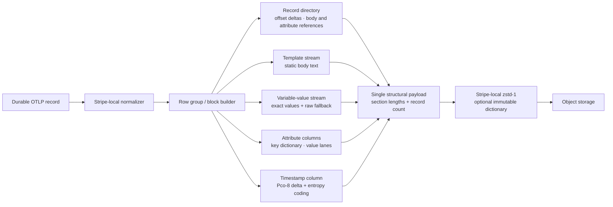

# Structural compression and locality architecture

## Outcome

Keep zstd level 1 as the online block codec, but stop presenting each durable
log record to it as one repeated row blob. Encode a sealed block as one
structural payload: a record directory and homogeneous sections for templates,
body values, numeric timestamps, and attributes. Optional bounded owner-local
statistics can place recurring, compression-similar records together before
block selection. The stripe-local zstd context compresses each resulting
payload. This retains the single-writer stripe model, durable offsets, and
exact record reconstruction while giving each codec homogeneous data.

Logs, traces, and metrics all use the single pre-release v1 durable format, but
their payloads remain signal-native:

- log frames use structural templates, Pco timestamps, field dictionaries, and
  the compressed-domain term/field index;
- trace heads are collected by trace and then packed by partition into bounded
  8 MiB multi-trace blocks; each block prefix/XOR encodes IDs, Pco-encodes times
  and durations, and refers to exact tenant/resource/scope/name/attribute/event/
  link/status values through block-local ordinals before Zstd-1;
- metric chunks delta-of-delta encode timestamps, Pco-encode integer samples,
  Gorilla-bitpack exact floating-point XOR windows, and Zstd-encode homogeneous
  histogram/summary lanes. Description, metadata, and exemplar sets use
  chunk-local ordinals.

The ordinal builders use linear search for up to 16 distinct values and promote
to a hash table only for higher-cardinality blocks. This keeps common repeated
telemetry on the cache-friendly path while bounding high-cardinality insertion
cost. Every dictionary is part of its checksummed block; no mutable global
interner is required for decoding.

Resource contexts, scope contexts, and typed attributes also receive stable
128-bit content identities. The owner stripe indexes those identities together
with trace links from logs, spans, span links, and metric exemplars. Correlation
postings contain only durable record references and are strictly bounded; if
the optional navigation index is full, ingestion and native per-signal indexes
remain exact and available.

Every immutable trace block and metric chunk also carries a compact
shared-identity Bloom filter. Catalog trace-ID ranges and these filters prune
cold object reads; candidate blocks are always decoded and compared exactly, so
filter collisions can add work but cannot add results. Primary trace IDs use
the exact sorted block range, leaving the trace Bloom bits for cross-trace span
links. Filters are computed while source records are still owned by the stripe
and survive object-tier restart without retaining record bodies in RAM.

Cold queries keep immutable control and payload data in separate recoverable
SSD caches. Catalog pages, group manifests, query indexes, and metric recovery
indexes use the bounded control cache; compressed log frames, trace blocks,
and metric chunks use the payload cache. The standalone defaults reserve 8 GiB
and 512 GiB respectively. Both caches verify object checksums and per-chunk
integrity before returning bytes, and expose hit, miss, occupancy, and source
byte counters through `TelemetryService`.

Verified immutable chunks also have a separately bounded RAM tier. Ranges
contained in one chunk are returned as shared `Arc` slices, so repeated block
reads neither reopen SSD files nor copy payload bytes. The control cache can
additionally retain decoded catalog pages and group manifests under its own
conservatively accounted byte budget; immutable object keys are the cache
identity, and checksum validation still occurs before admission.

Trace and metric block filters are unioned into group and page catalog entries.
Cold correlation lookup can therefore reject an irrelevant root page before
reading its page object, or reject a group before reading its manifest. Trace
summaries combine the exact primary trace-ID range with the Bloom filter for
linked trace IDs. Group/page unions can increase false positives but cannot
create false negatives; decoded records remain the exact authority.

Selected payload extents are sorted and read as one batch. The cache retains
the current 4 MiB chunk in memory and returns adjacent single-chunk extents as
shared views, so one query neither reopens the same SSD chunk for every block,
repeats an object range request, nor copies every selected extent. This is an
execution optimization only: every block retains its own checksum and is
verified independently before decode.

The Adam error-loop corpus reached 33.13x with bzip2 and 27.56x with zstd-9 as
raw 8 MiB blocks. A trained dictionary and the current line-template prototype
did not improve that corpus materially. That is evidence to optimize data
representation before changing byte codecs; it is not evidence that 100x is
impossible on normalized OTLP traffic.

## Current baseline

The original row-oriented representation wrote, for every record, a fixed-width
logical offset, a fixed-width timestamp, a length-prefixed message, and repeated
length-prefixed metadata keys and values. `LogStripe` now collects durable
records into an active block and encodes one structural payload before its
stripe-local zstd context compresses it.

This is correct and simple, but it mixes fields with very different entropy:
timestamps and offsets are regular, attribute keys are repeated, template text
is repeated, and trace IDs or request IDs are often high-cardinality. One
mixed stream makes the high-cardinality values compete with the repeated
structure for compression history.

## Current block layout

Pre-release blocks use one current structural layout. Their descriptor records
the dictionary ID, codec, source size, structural size, and stored size. No
multi-version compatibility layer is needed before the first release.

### Current implementation

`src/structural.rs` implements exactly one pre-release layout. Its header is a
record count followed by length-delimited sections for offset deltas, a Pco
numeric timestamp stream, templates, bodies, attribute dictionaries, and
fields. It is decoded only after the enclosing zstd payload is decompressed.

The encoder is deliberately lossless:

- A body is eligible for a template only when its token shape occurs at least
  twice within the block. Otherwise it remains in the raw-body lane.
- The current tokenizer treats contiguous ASCII word/path characters containing
  a digit as a variable slot. Static text—including words such as `ERROR`,
  punctuation, and field labels—stays in the template. Rejoining literals and
  slots yields the byte-identical UTF-8 body.
- Attribute keys are block dictionaries. A value becomes a per-key dictionary
  ID only when it repeats at least twice; high-cardinality values remain direct
  UTF-8 values.
- The term index still tokenizes the original body. Structural tokenization is
  an encoding choice and never removes query terms or silently normalizes text.

The block descriptor records both logical `source_bytes` and the actual
`structural_bytes`, so compression reports can distinguish representation gains
from zstd's byte-codec gains.

### Single-pass attribute planning

The structural encoder resolves attribute identity once per input field. Its
first pass builds the per-key value dictionaries and a compact temporary plan
containing two `u32` IDs per field plus one cumulative `u32` field boundary per
record. The field lane consumes this plan directly; it does not call the
generic indexed field accessor or search key/value dictionaries a second time.
Values are retained once as `Arc<[u8]>`, allowing the occurrence counter and
final table to share bytes without another value copy.

Native records override the generic field visitor and walk tenant, stream
labels, and per-record metadata as contiguous segments. A 32-entry
direct-mapped key cache and one last-value slot per key recognize immutable
borrowed strings by address and length. A cache miss always falls back to exact
byte comparison. Pointer identity is only an acceleration hint: it cannot merge
different values or change serialized IDs, and the cache is discarded after
the batch.

The plan is bounded by the already-bounded input batch: eight bytes per field,
four bytes per record, unique key/value storage, and a fixed 768-byte key
cache. The structural wire layout is unchanged.

### Timestamp codec

Timestamps are a numeric column, not text and not general byte strings. The
pre-release format gives the complete `u64` nanosecond column to Pco level 8.
A real-block probe showed that Pco's automatic search consistently selected
classic mode with first-order consecutive delta coding. The production path
therefore fixes `ModeSpec::Classic` and `DeltaSpec::TryConsecutive(1)`, avoiding
the repeated model search while preserving the selected encoding. Pco divides
large inputs into bounded pages and entropy-codes the resulting bins. Decoding
writes into a vector sized from the enclosing structural record count and
rejects corrupt, truncated, short, or overlong Pco streams.

The selected codec followed real-data ablations on 3,796,013 timestamps:

| Timestamp representation | Stored bytes | Change from prior format |
| --- | ---: | ---: |
| Prior direction-tagged delta + zstd-1 | 4,510,097 | baseline |
| Two byte-shuffled `i32` words | 7,561,921 | +67.67% |
| Epoch hour/minute/second/millisecond/nanosecond columns | 7,181,696 | +59.24% |
| Pco level 8 | **3,330,012** | **-26.16%** |

Splitting absolute timestamps into components makes slow fields cheap but
materializes 8–12 bytes per record before zstd. It does not directly encode
the low-entropy adjacent deltas. The native checkpoint/predictor prototype
improved the integrated 1 GiB durable total by only 2.37% and cost throughput.
Pco reached 7.02 bits/value at 36.04 million values/s per core in its isolated
exact-roundtrip benchmark, close to the measured 6.32-bit delta entropy floor.

## Algorithmic block collation

`src/locality.rs` implements the optional placement policy. It borrows the
useful grouping mechanics from Pluribus—centroids, observed radius/variance,
farthest-point split seeds, nearest-centroid reassignment, bounded split
passes—and request-analyzer's deterministic structural fingerprint grouping.
It does not import their embedding model, `serde_json::Value`, global interner,
Rayon path, or floating-point confidence calculations.

One allocation-free scanner is shared by term indexing and collation. The
ASCII path scans bytes directly; arbitrary UTF-8 uses the equivalent Unicode
term path. It emits:

- a stable 64-bit shape hash over static literals, delimiters, dynamic-slot
  markers, and metadata keys, excluding metadata and message values;
- a 16-bit integer SimHash over static features plus dynamic value type and
  logarithmic length classes; and
- original message terms through a callback. The posting writer suppresses
  duplicate terms by checking the record already at the tail of a posting
  list, so no temporary term set is needed.

The SimHash is `CompressionTemperature`. Its bits form a locality signature;
distance is XOR Hamming distance. A lower numeric value is not inherently
colder than a higher value. Eden-style exact shape grouping contributes a
fixed four-point distance penalty when template-shape hashes differ. This
keeps exact structures strongly collated while retaining a graded distance for
nearby structures. Hash collisions can affect placement quality only.

### Block score

For every complete candidate block or sub-block, the collator calculates:

- a byte-weighted majority-bit temperature;
- a representative exact template-shape hash;
- byte-weighted mean squared locality distance (temperature Hamming distance
  plus any shape penalty), stored as an integer Q8 variance;
- maximum record-to-block locality deviation;
- source bytes; and
- record count.

Larger variance is always worse because it means one compression history must
represent less similar text. Weighting by logical bytes makes a large,
high-entropy message count in proportion to the compression work it creates.
Individual weights saturate at `u32::MAX`, keeping all score arithmetic
bounded.

### Filter, split, redistribute, refill

Each stripe owns at most 16 adaptive compression-shard profiles. A profile
contains one source cohort, a byte-weighted temperature, a Q8 variance EWMA,
block count, byte volume, and deterministic placement ID. Profiles are
stripe-local mutable state; only immutable dictionaries are shared.

The hot path chooses the nearest tentative shard for collection. The decision
is deliberately provisional. When a collector reaches its target bytes:

1. Score the complete block and compare it with its current shard and every
   other profile for the same source cohort.
2. If variance exceeds the configured threshold, or another shard is closer,
   choose the first record as one seed and the farthest temperature as the
   second seed.
3. Assign every record to its nearest seed. Reject a split if either child is
   below the configured record or byte floor.
4. Repeat once more when a child remains variant. Two split levels bound one
   input block to at most four leaves.
5. Keep leaves close to the current shard. Move deviating leaves to the
   destination shard's active buffer. The holes are filled by later matching
   records before that block seals.
6. Admit a new profile only for a sufficiently large, sufficiently compact
   leaf—4 MiB by default—and only while the 16-profile budget has capacity.
   Otherwise use the original OTLP cohort.

Rebalanced full blocks are rescored. A three-pass safety cap guarantees
progress if profiles move while blocks are being refilled. Explicit shutdown
flushes score remaining sparse blocks once and seal every leaf.

Repeatedly splitting a high-variance cohort is wasteful when every resulting
leaf still fails admission. A fixed 64-slot stripe-local table backs off after
two such failures, keeps intervening blocks whole, and probes again after 63
suppressed blocks. Existing compression shards always remain eligible for
normal split and reassignment. The table is deterministic, bounded, and adds
no shared state.

An unsplit block represents membership as an allocation-free contiguous range.
Only real sub-blocks use packed little-endian `u32` input indices. The
partitioner writes left indices followed by right indices into one
`BytesMut`; `bytes-handoff` then transfers the complete left prefix and
remaining right tail as owned `Bytes`. Log bodies and metadata stay in their
original `Arc`s. The crate is an ownership and boundary primitive—the integer
collator still performs the scoring.

`CompressionPlacementId` selects active blocks and immutable dictionaries.
`DurableLog::compression_cohort` remains the producer-derived cohort.
Because final placement does not exist until block scoring,
`IndexReceipt` returns the record temperature, tentative collection placement,
and zero or more descriptors sealed by that append. Every descriptor stores
the final block temperature, representative shape hash, Q8 variance, and
maximum deviation.

Hash collisions can reduce grouping efficiency only. The structural encoder
still compares every literal byte before sharing a template, so unrelated
messages cannot be merged and exact reconstruction is unaffected.

### 1. Offset and timestamp columns

Store the first offset once per block and later offsets as unsigned deltas.
Encode the complete timestamp column with Pco level 8. A row stores compact
references into the body and attribute streams rather than repeating those
values inline.

This preserves exact ordering: row ordinal maps to the durable logical offset,
and the decoder reconstructs the original record from the structural sections.

### 2. Body template stream with lossless fallback

For a body whose stable tokens form a template, write the template once and
store a template ID plus the variable slots for each occurrence. Keep a raw
body lane for parse failures, novel bodies, and messages whose template is not
repeated enough to amortize its table entry.

Templates are an encoding optimization, not a lossy parser. Reconstructing the
template and variable slots must yield the exact original UTF-8 body. Static
template terms can feed the existing term index; variable values stay out of a
global term dictionary unless they are explicitly promoted as metadata.

### 3. Attribute columns

Dictionary-encode attribute keys per cohort or per block. For each key, choose
one of three value lanes based on observed cardinality:

| Value shape | Encoding | Index policy |
| --- | --- | --- |
| Low cardinality: severity, service, region | Value dictionary ID + RLE/bit-packed IDs | Exact block and record postings |
| Medium cardinality: operation, error code | Per-block dictionary ID + compact row references | Block summary plus selective postings |
| High cardinality: trace ID, request ID, arbitrary payload | Length-prefixed direct values, compressed separately | No implicit posting; promote only on an explicit query requirement |

This prevents the high-cardinality lane from inflating the static-term index or
polluting compression of repeated metadata. It also removes repeated field keys
from the record stream.

### 4. Source cohorts and final placements

Active collectors are keyed by partition, source cohort, tentative placement
ID, and dictionary ID. A block may move only to another compression placement
inside the same source cohort; durable shard-stream ownership and partition
identity never move. Destination buffers are keyed by their final placement
and fill with compatible sub-blocks before seal. At most 16 learned profiles
exist per stripe, so sparse traffic cannot create an unbounded number of
partial compression blocks.

The durable corpus benchmark may package multiple placement frames inside one
source-span container. Each frame preserves increasing offsets for its
placement, and the verifier sorts reconstructed records by offset before
checking the original stream. The production `LogStripe` uses independent
active blocks rather than reordering records.

## Lifecycle options

| Priority | Hot write | Later rewrite | Intended use |
| --- | --- | --- | --- |
| Lowest latency | LZ4 structural payload | None | CPU-constrained, bursty ingestion |
| Default | Pco-8 timestamps + zstd-1 structural payload | None during pre-release | General searchable logs |
| Storage first | Pco-8 timestamps + zstd-1 structural payload | Re-evaluate after corpus measurements | Long retention with online search |
| Offline archive | zstd-9 structural block | Optional bzip2 artifact outside the query tier | Compliance/export only |

The default path is Pco-8 for timestamps, direct structural encoding for the
other sections, and zstd-1 over the enclosing payload. Pre-release does not
carry a raw-row fallback or multiple block-format versions: one encoder and
one decoder make every new sealed block use the same representation.

Use bzip2 only for an object explicitly marked offline. It has the best tested
ratio on this corpus, but its throughput and block-query behavior make it a
poor backing format for interactive log search. Do not add Zopfli to a storage
lifecycle: it was dominated by bzip2 in both ratio and encode throughput.

## Multicore durable ingest

The full-corpus path assigns deterministic complete-line byte ranges to workers
by fixed stride. One worker owns one input file handle, block collator,
normalized-record scratch, structural encoder state, reusable zstd context,
and append-only pack file. Workers do not send whole blocks through a shared
queue, share a collator or compressor, or lock around compression.

The structural encoder accepts a `StructuralRecordView`, allowing a parser to
expose borrowed message, timestamp, offset, and metadata fields without first
allocating a `DurableLog` and per-record `Arc`s. Tokenization stores byte
ranges into the normalized message. Template groups use a hash only to find
candidates and then compare every literal byte, so hash collisions cannot
merge unlike templates. Only selected template literals are copied.

Each block also owns a 1,024-entry direct-mapped parsed-layout cache. The cache
index samples message length and bytes, but a hit is accepted only after exact
message-byte comparison. Repeated messages reuse their signature and
literal/value ranges; a collision merely reparses the current message. The
cache is stripe/block-local, uses no locks or shared mutable state, and does not
change the structural wire format.

The current hot path further exploits repetition without weakening those
checks:

- Cache indexing uses the message length plus unaligned first/last eight-byte
  samples for normal log messages, with a complete-byte comparison before a
  hit is accepted.
- Messages already shared by the Docker adapter are recognized by slice
  identity before falling back to a byte comparison.
- Per-layout occurrence counts replace per-record template-selection work.
  Record layout IDs and cache entries are `u32`, while conversion is checked
  at the bounded layout-table boundary.
- A repeated layout is encoded once as an exact body fragment and copied for
  each occurrence. Singleton and high-cardinality messages keep the direct
  encoding path.

These are generic repetition optimizations: they depend on exact byte identity
and structural layout, not on ClickHouse message text.

Attribute construction probes existing byte slices before allocating a new
key or value. Key and value dictionaries use linear lookup through 16 entries,
which is faster for normal low-cardinality log metadata, and promote to hash
tables for wider blocks. This remains generic for arbitrary metadata and
preserves the same sorted value dictionaries and encoded IDs.

When compression-locality routing is disabled, both the direct corpus encoder
and `LogStripe` seal directly into the producer-derived base placement. They do
not allocate locality-record vectors, score or split the block, construct
membership maps, or move records through temporary placement groups. The
descriptor records zero temperature diagnostics, and collator observations
remain zero. Enabling locality retains the complete scoring and redistribution
path.

Each worker writes compressed blocks to its own pack. The final manifest sorts
entries by source ordinal and records source location, accepted and scanned
bytes, record count, pack location, compressed length, and payload checksum.
All packs and the manifest are synchronized before durable ingest completion.
A post-ingest verifier checks every payload checksum and decodes sampled
blocks.

Malformed complete Docker JSON records are counted and skipped while logical
offsets continue to reflect their original byte positions. Reports separate
complete-line input bytes, leading partial bytes, accepted source bytes,
rejected records, and rejected bytes so compression ratios never claim bytes
that were not stored.

The benchmark harness maps the immutable corpus read-only and gives workers
borrowed byte ranges. This removes a `pread`-to-`Vec` copy from performance
measurement without putting memory mapping or unsafe code in the storage
library. Production callers may provide any stable borrowed input buffer.

The current single pre-release format, with locality disabled, stored
620,912,446 bytes at 138.34x and 3,622.67 MiB/s on 16 physical cores. All
10,240 payload checksums and sampled exact reconstructions passed. It is
7,561,221 bytes smaller than the accepted historical Pco-8 result even though
the current payload retains its compression-derived lookup index. The
historical one-core implementation sustained 1,157.26 MiB/s, but that result
predates the current frame index and is not presented as a current per-core
measurement. The locality-enabled precursor performed 528 unproductive splits
and 83,512,504 bytes of membership handoff, so routing remains disabled by
default. The fresh retained ClickHouse baseline stored 1,175,650,470 bytes at
73.07x and 915.72 MiB/s.

## Dictionary policy

`src/realtime_dictionary.rs` implements the optional online policy around the
existing `DictionaryCatalog`, immutable generations, and stripe-local LRU.
There is one bounded background control-plane worker; compression contexts and
mutable caches remain stripe-local. A sealed block submits through a
nonblocking queue, so trainer saturation drops learning evidence rather than
applying ingestion backpressure.

The default learner:

1. Fairly samples at most 256 KiB from the exact template, encoded-body,
   attribute-table, and field sections of one final placement. It excludes
   offset deltas and Pco timestamps because those numeric encodings provide
   little reusable byte vocabulary.
2. Accumulates 4 MiB of samples and trains one 64 KiB Zstandard dictionary.
   Training examples preserve section/window boundaries rather than presenting
   one artificial concatenated string.
3. Shadow-compresses later bounded structural-block samples both with the active
   dictionary-free/current path and with the candidate. Evaluation occurs in
   16-block batches and accumulates across batches.
4. Publishes only after observed candidate savings repay all 64 KiB of
   dictionary storage, leave at least 16 KiB net gain, and clear 200 basis
   points. A candidate that loses or fails to repay itself within 256 MiB of
   observed structural data is rejected.
5. Content-addresses accepted bytes with the first 128 BLAKE3 bits, publishes
   an immutable placement assignment, and lets stripes adopt it only at append
   boundaries. Each block pins the exact dictionary ID used.

The queue is capped at 64 block observations and training state at 16
placements. The default worst-case retained sample budget is approximately
96 MiB across the control plane: 32 MiB in the queue and at most 64 MiB in
placement training/evaluation state. A queue overflow, placement-cap hit,
trainer failure, unprofitable candidate, or process restart leaves ordinary
dictionary-free blocks fully valid.

Dictionary assignments in the durable benchmark use sparse runs of
`(first block, block count, dictionary ID)`. If no block adopts a dictionary,
no sidecar is created. This keeps fail-open storage byte-identical to the
disabled control.

### Measured block-size tradeoff

A local 1 GiB stationary stream was constructed by repeating a 38.7 MB Docker
JSON adaptation of genuine macOS install, Wi-Fi, and launchd logs. Repetition
extends one real distribution long enough to exercise online payback; it is
not an independent 1 GiB production population.

| Block target | Dictionary | Durable bytes | Ratio | Outcome |
| --- | --- | ---: | ---: | --- |
| 512 KiB | Disabled | 45,274,883 | 23.72x | Control |
| 512 KiB | Real-time | **43,101,435** | **24.91x** | One 64 KiB generation; 4.80% fewer bytes |
| 8 MiB | Disabled | **38,836,543** | **27.65x** | Control |
| 8 MiB | Real-time | **38,836,543** | **27.65x** | Candidate rejected; exact no-regression |

The 512 KiB timing median was 1,448.59 MiB/s disabled and 1,358.87
MiB/s enabled, a 6.19% cost while remaining above 1 GiB/s. Larger 8 MiB blocks
still compressed the corpus more effectively than small dictionary-backed
blocks because they give Zstd a much longer in-frame history. Online
dictionaries are therefore a query-granularity tool: they recover compression
lost to small independently readable blocks, not a replacement for choosing
the largest block size the read path can tolerate.

Earlier 8 MiB Adam trials that trained from a mixed structural sample or from
original message bodies both correctly published nothing. The exact
structural-lane learner must still be rerun on Adam's immutable 80 GiB corpus
and on a non-repeated heterogeneous service stream before it can become a
default.

## Validation status and remaining work

Implemented tests cover exact Pco timestamp reconstruction for regular,
non-monotonic, extreme, and arbitrary `u64` values; malformed/truncated Pco
payload and count rejection; dynamic-value fingerprint stability; static-message
changes, homogeneous admission, sparse/restarted/capacity fallback,
farthest-seed splitting, bounded two-level recursion, deterministic
assignment, split backoff, exact membership handoff, ordered sub-block merge,
mixed-block filtering/refill, bounded profile state, Unicode terms, exact
field and term results, block-temperature diagnostics, exact dictionary-lane
selection, bounded fair sampling, cumulative payback, immutable publication,
sparse assignment runs, checksums, decompression, and byte-identical
reconstruction.

`shard-telemetry-locality-bench` measures fingerprint sizes, tentative 16-shard
probe cost, complete block score/split/assignment throughput,
`bytes-handoff` membership volume, persistent state, combined single-thread
throughput, and p50/p99 seal latency. `run-head-to-head.sh` performs sequential
disabled/enabled/ClickHouse legs with identical prewarming and CPUs.
`run-locality-interleaving.sh` creates a deterministic round-robin corpus from
multiple Docker/OTLP-adapter outputs and compares the routing ablation.

1. Benchmark normalized OTLP records, not only raw Docker JSON wrappers. Keep
   the HDFS corpus, the Adam error-loop corpus, and at least one heterogeneous
   production-like corpus.
2. Run a block-size matrix at 1, 4, 8, 32, and 64 MiB. Measure ratio, encode
   throughput, tail seal latency, active memory, and recovery granularity.
3. Expand the deterministic interleaving run beyond the current bounded
   Pluribus, Eden, and OTEL Collector samples. That first real-service run
   reduced stored size by 4.05%, but is too small for a general claim.
4. Account for every byte: manifests, templates, dictionaries, block indexes,
   metadata postings, and object-store envelopes. Do not count raw payload
   compression as total storage.
5. Assert byte-identical record reconstruction, ordered-offset replay, term
   and exact-field query equivalence, and bounded decode amplification for
   targeted reads.
6. Rerun exact-lane real-time dictionary learning on Adam at 512 KiB, 1 MiB,
   and 8 MiB targets. Keep it opt-in unless heterogeneous data shows a durable
   gain and the 8 MiB homogeneous run remains byte-identical.

The final full error-loop benchmark establishes 136.69x, more than 1 GiB/s on
one core, and 7.40 GiB/s on 16 physical cores for that one population. Every
record correctly remained in base placement.
The bounded three-service interleaving run measured a historical 4.05%
stored-size reduction using seven specialized placements; the current block
collator must produce a net durable gain on a larger heterogeneous corpus
before locality routing can become the default.

## Compression-derived durable frame index

The current pre-release ingest pack makes the compressor's own dictionaries
serve both storage and exact lookup. There is no second per-record hot posting
index on the native/Loki durable path:

1. Native or Loki records are normalized once and grouped by source compression
   cohort.
2. `encode_indexed_structural_records` builds template IDs, token templates,
   attribute dictionaries, repeated field sets, and their forward record
   columns in one pass.
3. The structural frame embeds one index section without a second format
   header. Collision-safe 24-bit fingerprints point to template or field-set
   IDs. Forward columns choose run-length or bit-packed encoding per block.
4. The template-ID column is authoritative for body reconstruction, so the body
   lane does not repeat a kind byte and template ID for every record. Dynamic
   terms and direct/high-cardinality fields use one shared bounded membership
   hint and fail open to a candidate superset. Selective structural decode and
   `LogQuery::matches` remain the exact authority.
5. The enclosing `SLW1` ingest pack stores independently checksummed,
   Zstd-compressed cohort frames. Its group descriptor includes record count,
   structural length, compressed checksum, and minimum/maximum timestamp.
6. Live ingestion hands only the already-encoded index section to the owning
   stripe. Recovery reconstructs the same index from the durable compressed
   frame; it does not recreate millions of `DurableLog` objects or a
   second term/field map.

The in-memory stripe state retains `Bytes` slices over authoritative compressed
frames plus the decoded bounded index representation. Candidate ordinals are
group-local; the structural offset lane stores the original append ordinal, so
interleaved compression cohorts map back to exact durable offsets without an
extra remap table.

Shard-stream keeps immutable pack paths and extent metadata, not one open
`File` per rolled pack. Fetch opens a reader for one coalesced range and closes
it afterward. This is deliberate: a nominally bounded per-shard reader cache
still multiplies by shard count and can exceed a process-wide descriptor limit.
The full 80 GiB run used 1,842 durable files while holding 44 descriptors after
ingest and after recovery.

Tenant-partition fanout is sent once to each stripe owner. For limited timestamp
queries, a stripe orders frame descriptors by their min/max timestamp and keeps
only the current top K. It stops when the next unopened frame cannot improve
the result boundary. Equal boundary timestamps are still opened because offset
ordering must remain exact.

Hash and filter collisions can only add decode work. They cannot remove a
matching record, merge unlike templates, alter metadata, or change exact
reconstruction. Corrupt compressed payloads are rejected by their checksum;
malformed index sections, packed columns, counts, and structural sections are
strictly validated.

Current limitations are explicit:

- Arbitrary LogQL substring and regex predicates remain residual filters.
  The older sealed-block query directory has trigram rejection, but those
  trigrams have not yet been folded into the compressor-derived frame index.
- Cold queries still decode each selected signal-native block. The next
  storage step is adding bounded asynchronous prefetch and more selective
  trace/metric lane decoding without weakening exact reconstruction.
- The native decoder still materializes owned strings before structural
  encoding. A borrowed native-record view would remove the UTF-8 validation,
  allocation, and free costs visible in the current production profile.
